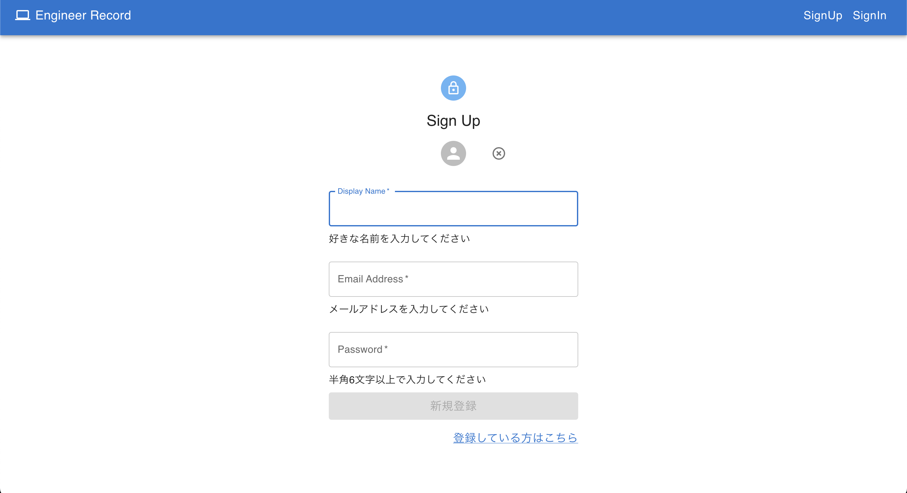
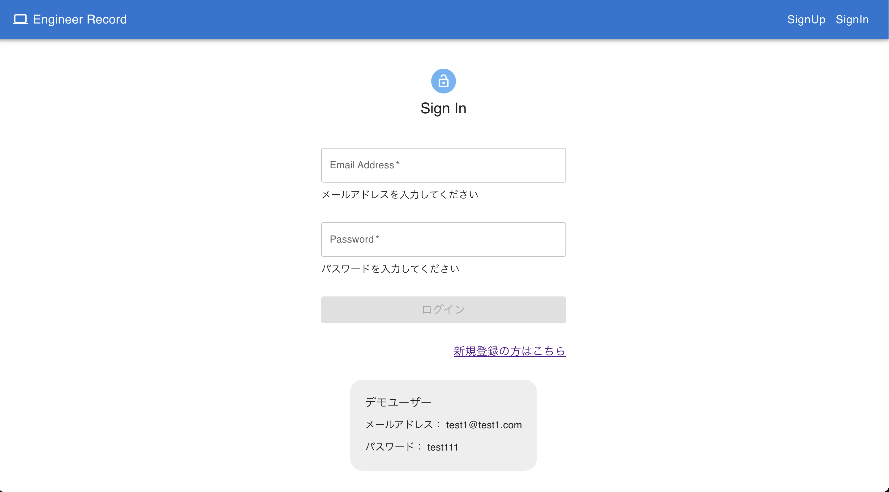
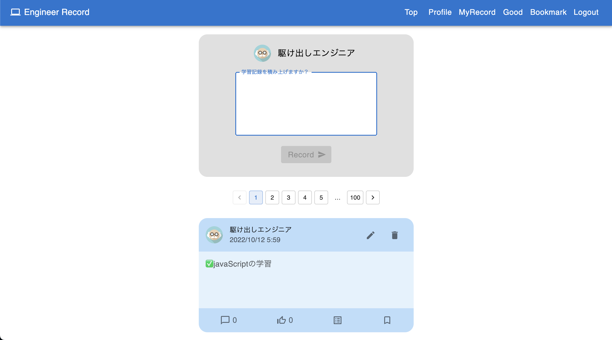
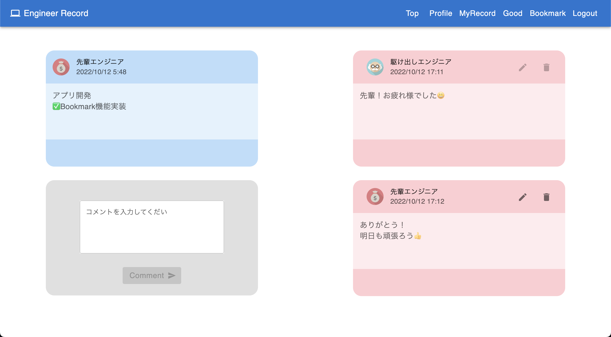

 

 

# アプリケーション名
## Engineer Record 
 

# 概要
#### プログラミング学習における学習記録を積み上げるSNSアプリケーションです。プログラミング学習者とのコミュニケーションを図ることができ、自分の積み上げてきた経緯を見ることができるため、自身の学習のモチベーション維持に役立てることができます。
 

# 開発背景
#### プログラミングを学ぶ上で大事なことは学習を継続することだと考えております。自身が完全未経験から学習を開始し、その際にSNSで学習の積み上げをしてきた経験から、自分の学習成果を残すこと、他の方の学習の成果を見ることは学習を続けていくことへのモチベーションとなりました。この経験を踏まえ、今後プログラミング学習を開始する方や、現在も学習を継続している方に学習の積み上げをしてほしいという想いからアプリケーションを開発しました。
 

# URL
https://engineer-record.vercel.app/
 
 
# アプリケーション利用方法

### １　サインアップ（新規登録）/ サインイン（ログイン）
 

- サインアップ（新規登録） Avator、displayName、メールアドレス、パスワードを設定し新規登録します。(Avatorについては任意設定)
 

- サインイン（ログイン） 登録済みのアカウントでログインします。
 
 

#### テスト用アカウント(デモユーザーとしてサインイン可能)
- メールアドレス : test1@test1.com
- パスワード : test111
 
 

 
 

  
 
 

### ２　Topページのフォーム欄から学習の積み上げを投稿
 

#### ヘッダーから自身の積み上げ投稿、Goodした投稿、Bookmarkした投稿を確認することができます。 投稿には、Edit/Delete/Comment/Good/Good List/Bookmarkボタンがあります。(Edit/Deleteは、投稿者のみが使用可能)
 
 

  
 
 

### ３　投稿に対しコメント
 

#### CommentボタンよりCommentページに遷移し、投稿に対しコメントができます。
 
 

  
 
 

# アプリケーション機能

- 認証（サインアップ/サインイン/ログアウト）
- ユーザー編集（Abator/displayName編集可能）
- 学習記録投稿/リスト表示/編集/削除
- コメント投稿/編集/削除
- Good（いいね）追加/リスト表示/削除
- Good（いいね）しているユーザーのリスト閲覧
- Bookmark追加/リスト表示/削除
  

# 実装予定機能
- フォロー/フォロワー機能
- ユーザーprofile閲覧機能
  

# 開発技術
### フロントエンド
- HTML
- CSS
- TypeScript
- React(v18.2.0)
- Next.js(v12.3.0)
- recoil
- material-ui
 

### バックエンド
- firebase(v9.9.4)
 
 

# ローカル環境下での動作方法
### １　git clone https://github.com/kaji5963/Engineer-Record.git
### ２　cd Engineer-Record
### ３　yarn
### ４　yarn dev
  

# 工夫した点
- プロフィール編集機能を実装しており、プロフィールの編集時に自身が投稿した過去の投稿の内容も修正されるようにfirebaseのデータ構造を工夫し実装しました。
 

- 自身の学習の積み上げ、どの投稿に対しGood（いいね）やBookmarkをしたかがわかるようにリスト表示するページを実装したことで、ユーザーの情報を管理しやすくしました。
 
 

# 苦労した点
- firebaseからのデータ取得のタイミングや、取得後の表示に苦労しました。特にGood(いいね)機能の実装は、firebaseのデータ構造をよく考えデータの管理をしました。データ取得後の画面表示は条件分岐を工夫しユーザーのGoodの有無や、他のユーザーが押しているかなどを考え実装しました。
 

- プロフィール編集後のユーザーの名前や画像の表示に苦労しました。過去の投稿に対してどのように表示を変えたらいいのか悩み苦慮しましたが、firebaseのデータ構造を考え、データ取得後に名前や画像を変数に格納し管理することで実現しました。
